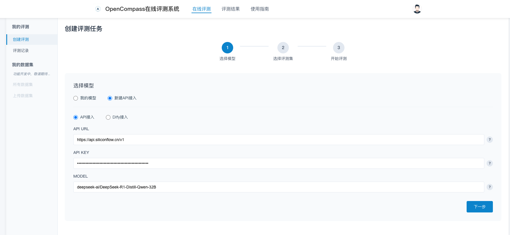

# ai-eval-system
这是一个基于OpenCompass的模型评测系统，该系统提供了前端页面UI以方便用户自助开展评测工作。

## 版本发布
v0.2：
- 支持API方式进行Dify平台应用的评测
- 优化评测任务创建时的交互过程，包括API_URL等信息的输入、数据集的选择、评测信息的确认
- 优化评测任务页面的显示，区分我的评测和全部评测
- 优化评测任务终止时使用Celery原生方法不稳定的问题
- 服务进行Docker化，方便快速部署

v0.1：
- 支持基于OpenCompass的B/S架构的模型评测
- 支持API方式提交评测任务
- 支持评测任务的队列管理功能，包括创建、排队、运行、终止等
- 支持评测过程的日志的实时监控
- 支持评测结果的导出


## 使用方法
### 1. 创建评测任务
1. 注册并登录系统
2. 顶部菜单→在线评测→创建评测
3. 选择自定义API类型
4. 在编辑框内输入要测评的API_URL、API_KEY、MODEL_NAME

5. 点击下一步，选择预置的数据集，例如：demo_math_chat_gen
6. 点击下一步，开始评测即可。


### 2. 查看评测进程
1. 创建评测任务之后
2. 在评测记录列表中，点击日志按钮，可以实时查看任务执行的日志情况


### 3. 查看评测结果
1. 当评测任务执行完毕之后
2. 在评测记录列表中，点击结果按钮，可以查看评测执行结果

3. 点击"下载完整结果"，可以将执行任务的完整记录下载分析


> 说明：
> - `predictions` 目录中的日志为对应评测数据集的详细记录，其中：
> - `origin_prompt` 是测试的问题描述。
> - `prediction` 是模型预测的答案。
> - `gold` 是该问题的标准答案。


## 项目架构

### 系统架构流程
```
┌─────────────┐    ┌─────────────┐    ┌─────────────────────┐    ┌───────────────┐
│             │    │             │    │                     │    │               │
│  前端应用    │───▶│  FastAPI    │───▶│  Celery 任务队列      │───▶│ OpenCompass   │
│  (Vue3)     │    │  服务       │     │  (Redis)            │    │ 评测引擎       │
│             │◀───│             │◀───│                     │◀───│               │
└─────────────┘    └─────────────┘    └─────────────────────┘    └───────────────┘
      │                  │                       │                       │
      │                  │                       │                       │
      │                  ▼                       ▼                       ▼
┌─────────────────────────────────────────────────────────────────────────────┐
│                                                                             │
│                             数据存储层                                        │
│                          (MySQL + Redis )                                   │
│                                                                             │
└─────────────────────────────────────────────────────────────────────────────┘
```
### 1. 分层架构设计
- 前端层：Vue3 + WebSocket（实时状态）
- 服务层：
  - API服务：FastAPI（RESTful API）
  - 异步任务引擎：Celery + Redis（分布式任务队列）
  - 核心评测引擎：OpenCompass封装层（Python API调用）
- 持久层：
  - MySQL（关系型数据）
  - Redis（缓存/消息中间件）


### 2. 关键技术组件
1. **FastAPI**: 提供高性能API服务，支持异步请求处理和自动API文档生成
2. **SQLAlchemy**: ORM框架，实现数据模型与数据库的映射
3. **Celery**: 分布式任务队列，处理长时间运行的评测任务
4. **Redis**: 作为Celery的消息代理和后端存储，同时提供缓存功能
5. **OpenCompass**: 核心评测引擎，提供模型性能评估能力

### 3. 目录结构
```
ai-eval-system/
├── apps/                             # 主应用目录
│   ├── web/                          # 前端工程
│   │   ├── src/
│   │   └── package.json
│   ├── server/                       # 后端服务
│   │   ├── src/
│   │   └── start_celery_worker.py    # 启动Celery Worker
│   │   └── start_fastapi_server.py   # 启动FastAPI服务器
├── libs/                             # 第三方依赖库
│   └── OpenCompass/                  # 通过git子模块引入（保持独立更新）
│   └── Dify2OpenAI/                  # 通过git子模块引入（保持独立更新）
├── docker/                           # 容器化配置
│   ├── docker-compose-dev.yml        # 开发环境配置
│   └── docker-compose.yml            # 生产环境配置
├── docs/                             # 项目文档
│   └── 架构设计文档.md                 # 架构设计文档
├── scripts/                          # 运维脚本
│   ├── init_database.py              # 初始化数据库
│   ├── init_environment.sh           # 初始化环境
├── README.md                         # 项目说明
```

## 快速部署
你可以通过Docker方式快速部署，也可以通过开发者模式进行部署运行。

### Docker方式部署（推荐）
#### 1. 拉取代码
```bash
git clone https://github.com/domonic18/ai-eval-system.git
cd ai-eval-system

# 拉取子模块
git submodule update --init --recursive
```

#### 2. 配置环境变量
```bash
cd docker
cp .env.example .env
```
编辑.env文件，配置数据库连接信息

#### 3. 启动服务
```bash
# 前提：在docker目录下
docker-compose up -d
```

#### 4. 访问系统
待docker容器启动完毕后，访问系统
```bash
http://localhost
```

### 开发模式运行
这种模式下，适用于开发者本地调试场景下。

#### 1. 创建虚拟环境
```bash
conda create -n eval python=3.10
conda activate eval
```

#### 2. 安装依赖
```bash
# 源码方式安装OpenCompass
cd libs/OpenCompass
pip install -e .

# 安装基础依赖(切换至根目录下)
pip install -r requirements.txt

# 安装ai-eval-system(切换至根目录下)
pip install -e .

```
> 备注：
> 1. 安装过程如果比较慢，可以在在pip命令后添加-i {镜像地址}
> 2. 清华源地址：https://mirrors.tuna.tsinghua.edu.cn/pypi/web/simple

#### 3. 启动mysql和redis
```bash
# 切换至docker目录
cd docker

# 启动mysql和redis
docker-compose -f docker-compose-dev.yml up -d
```

#### 4. 启动FastAPI服务器
```bash
cd apps/server
python start_fastapi_server.py
```
服务器将在 http://localhost:8000 启动，可以通过访问 http://localhost:8000/docs 查看API文档。

#### 5. 启动Celery Worker
```bash
cd apps/server
python start_celery_worker.py
```
这将启动Celery Worker处理异步评测任务。

#### 6. 启动前端服务
```bash
cd apps/web
npm install
npm run dev
```
前端服务将在 http://localhost:5173 启动，可以通过访问 http://localhost:5173 查看评测系统UI。


## TODO
基础建设
- [ ] 集成OpenCompass多模态任务的评测引擎VLMEvalKit
- [ ] 优化Docker容器内下载数据集异常的问题

前端页面
- [ ] 支持数据集的基础后台管理功能，包括增、删、改、查
- [ ] 支持"我的模型"功能，包括增、删、改、查
- [ ] 支持评测榜单功能，实现评测结果的可视化
- [ ] 支持数据集在线化编辑功能


