# AI评测系统架构设计规范（更新版）

## 1. 系统概述
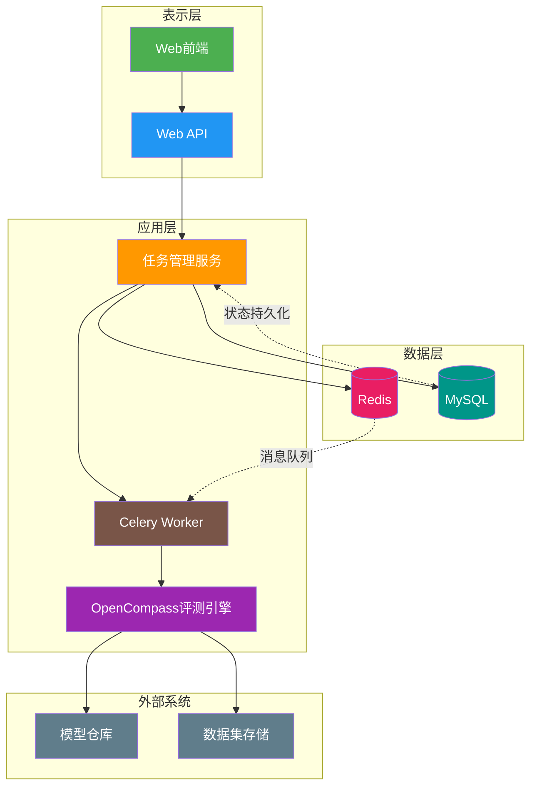

## 2. 核心组件

### 2.1 任务管理组件
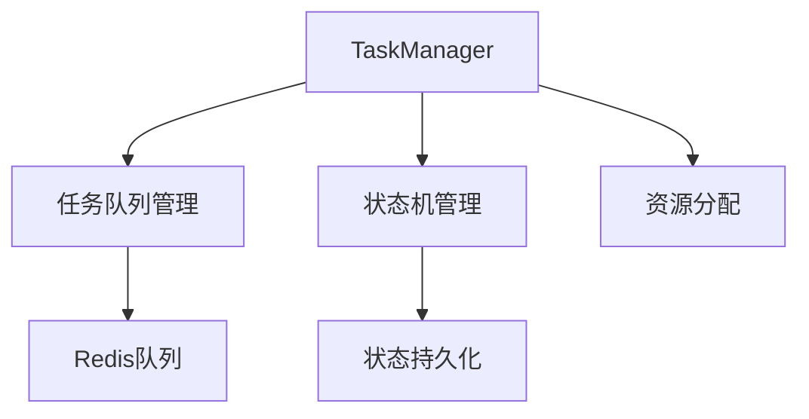

### 2.2 通信层组件
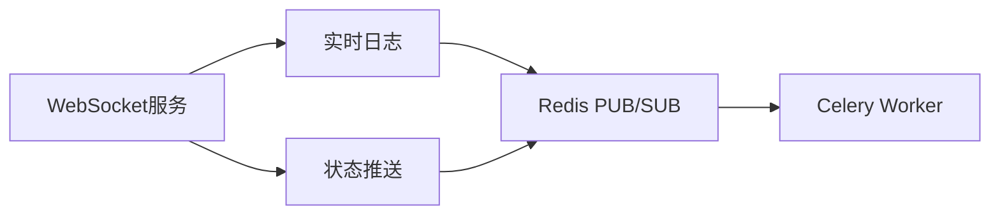


### 2.3 数据流设计
#### 2.3.1 任务生命周期数据流
##### 2.3.1.1 任务创建执行流程
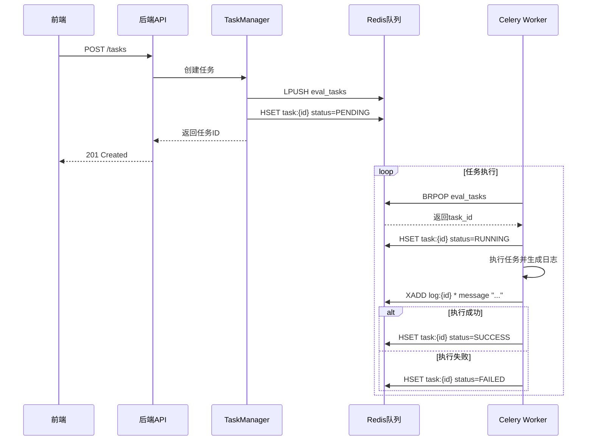

##### 2.3.1.2 任务完成执行流程
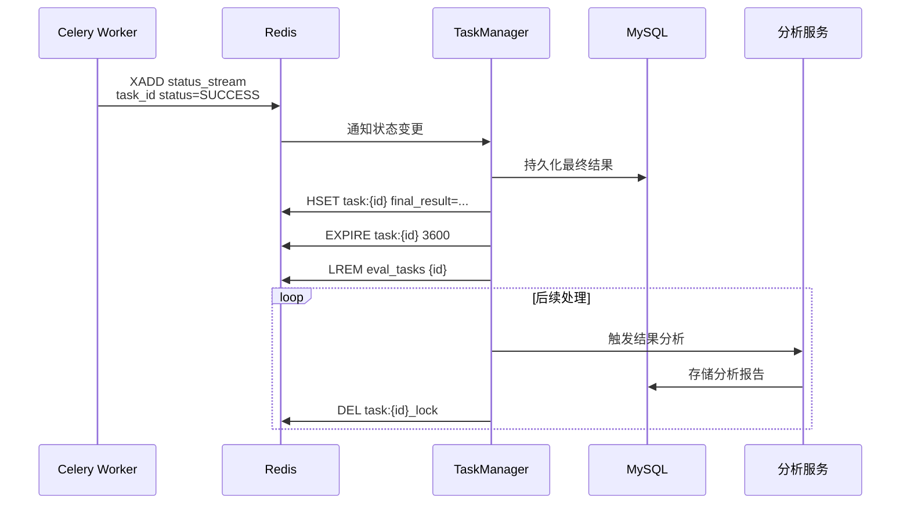

##### 2.3.1.3 任务终止执行流程
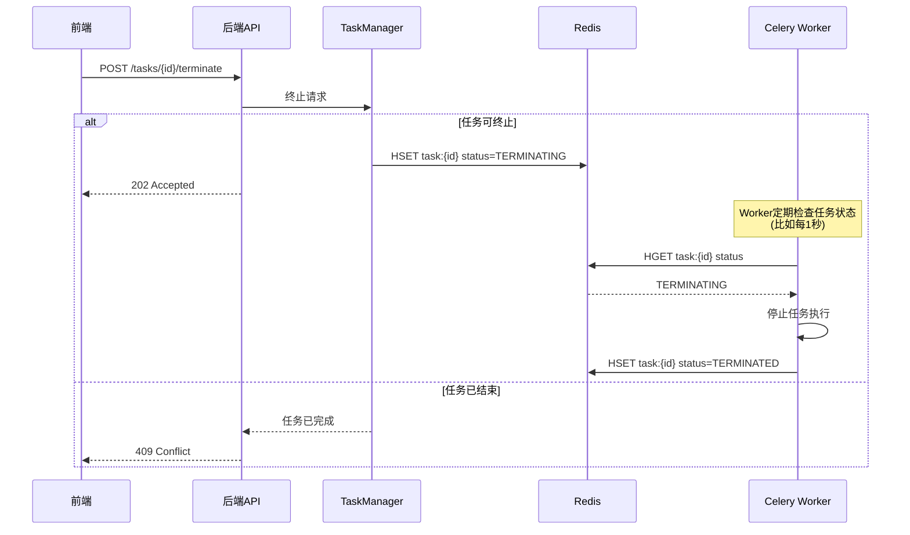

##### 2.3.1.4 任务队列管理流程（混合架构方案）

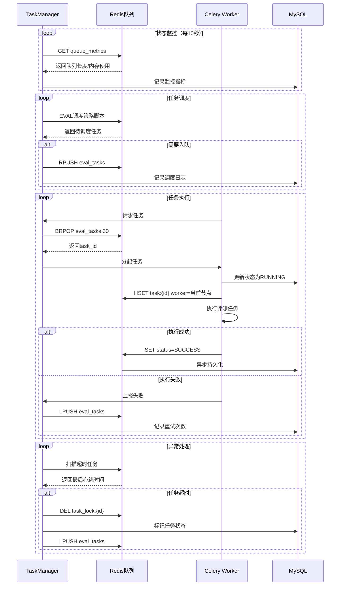

#### 2.3.2 日志数据流
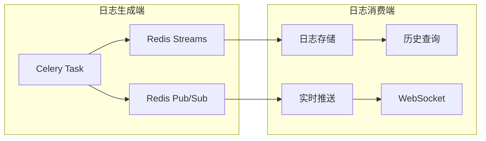

##### 2.3.2.1 WebSocket建立连接
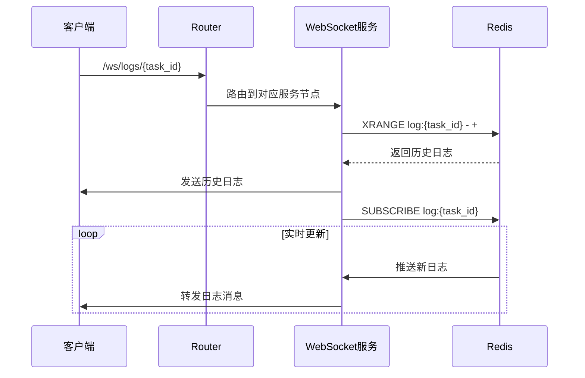


##### 2.3.2.3 WebSocket关闭连接
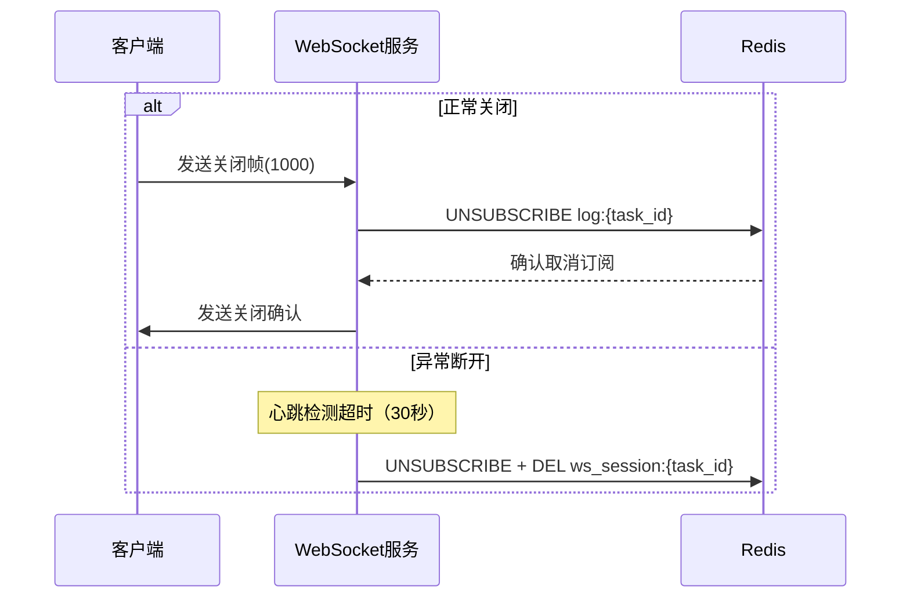

### 2.4 任务状态跟踪
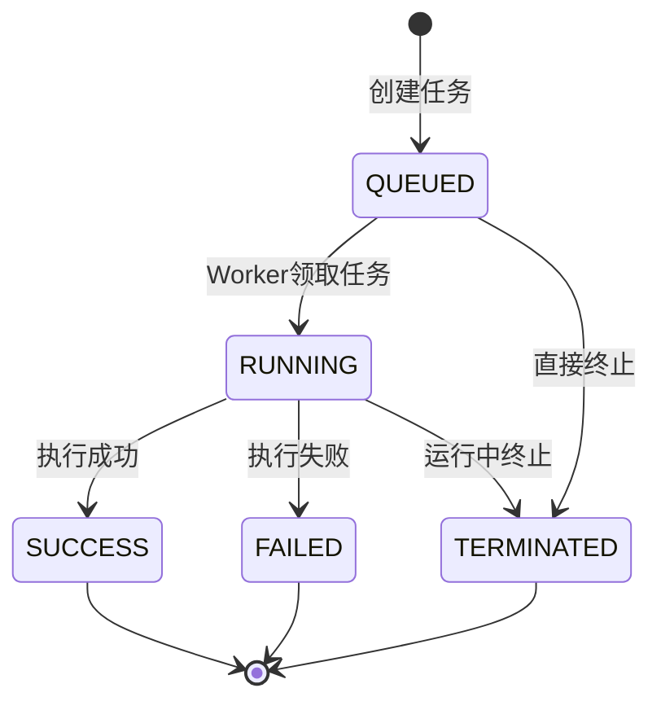


## 3. 数据存储
### 3.1 Redis数据存储
#### 键命名规范
| 数据类型       | 键格式示例                  | 存储类型 | 说明                     |
|----------------|----------------------------|----------|--------------------------|
| 任务状态       | `task:{task_id}:status`    | String   | 存储当前任务状态         |
| 任务进度       | `task:{task_id}:progress`  | Hash     | 包含进度百分比和消息     |
| 任务队列       | `queue:eval_tasks`         | List     | 待处理任务ID列表         |
| 日志存储       | `log:{task_id}`            | Stream   | 任务执行日志流           |
| 锁机制         | `lock:{resource}`          | String   | 分布式锁                 |
| 缓存数据       | `cache:{key}`              | String   | 通用缓存数据             |

#### 任务状态数据结构示例
```python
{
    "status": "RUNNING",
    "last_update": "2024-03-10T14:30:00Z",
    "worker_node": "celery@node01"
}
```

#### 日志流消息格式
```python
{
    "timestamp": "2024-03-10T14:30:00.123Z",
    "level": "INFO",
    "message": "开始执行模型推理",
    "progress": 0.15
}
```

### 3.2 MySQL数据库表结构

#### 核心表结构概览
```sql
-- 用户表
CREATE TABLE users (
    id INT AUTO_INCREMENT PRIMARY KEY,
    username VARCHAR(50) UNIQUE NOT NULL,
    password VARCHAR(255) NOT NULL,
    email VARCHAR(255) UNIQUE NOT NULL,
    is_active BOOLEAN DEFAULT TRUE,
    is_admin BOOLEAN DEFAULT FALSE,
    created_at DATETIME DEFAULT CURRENT_TIMESTAMP,
    updated_at DATETIME DEFAULT CURRENT_TIMESTAMP ON UPDATE CURRENT_TIMESTAMP
);

-- AI模型表
CREATE TABLE ai_models (
    id INT AUTO_INCREMENT PRIMARY KEY,
    name VARCHAR(255) NOT NULL,
    provider VARCHAR(100) NOT NULL,
    model_type VARCHAR(50) NOT NULL,
    version VARCHAR(50),
    configuration JSON NOT NULL,
    is_public BOOLEAN DEFAULT TRUE,
    user_id INT,
    created_at DATETIME DEFAULT CURRENT_TIMESTAMP,
    updated_at DATETIME DEFAULT CURRENT_TIMESTAMP ON UPDATE CURRENT_TIMESTAMP,
    FOREIGN KEY (user_id) REFERENCES users(id)
);

-- 评估任务表
CREATE TABLE evaluations (
    id INT AUTO_INCREMENT PRIMARY KEY,
    task_id VARCHAR(255) UNIQUE,
    model_name VARCHAR(255) NOT NULL,
    dataset_name VARCHAR(255) NOT NULL,
    status VARCHAR(50) NOT NULL DEFAULT 'pending',
    results JSON,
    created_at DATETIME DEFAULT CURRENT_TIMESTAMP,
    updated_at DATETIME DEFAULT CURRENT_TIMESTAMP ON UPDATE CURRENT_TIMESTAMP
);

-- 索引示例
CREATE INDEX idx_evaluations_status ON evaluations(status);
CREATE UNIQUE INDEX idx_task_id ON evaluations(task_id);
```

#### 数据库表关系

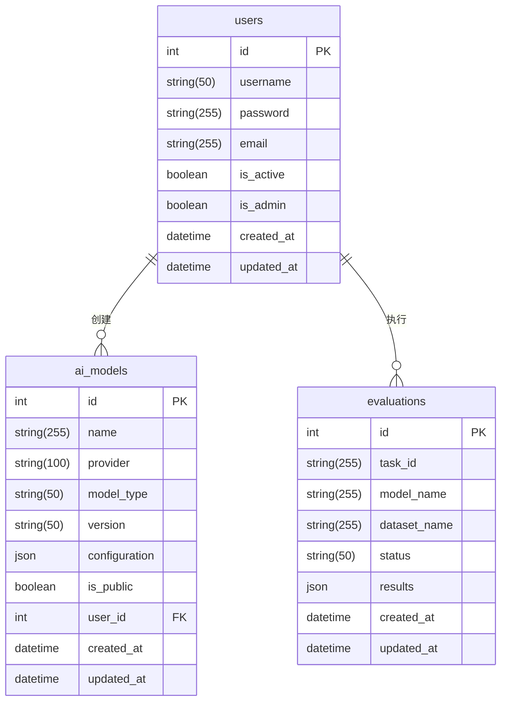


## 4. 通信协议规范

### 4.1 REST API 接口规范

#### 4.1.1 接口基础定义
| 基础路径       | 内容类型         | 认证方式       |
|---------------|------------------|---------------|
| `/api/v1`     | `application/json` | Bearer Token |

#### 4.1.2 任务管理接口

##### 创建评估任务
```http
POST /api/v1/evaluations
Content-Type: application/json
Authorization: Bearer <token>

{
  "model_name": "gpt-3.5-turbo",
  "dataset_name": "mmlu",
  "model_configuration": {
    "api_key": "sk-xxxxxx",
    "api_base": "https://api.openai.com/v1"
  },
  "dataset_configuration": {
    "subset": "mathematics"
  },
  "eval_config": {
    "max_samples": 100
  }
}
```

**响应：**
```json
{
  "id": 123,
  "model_name": "gpt-3.5-turbo",
  "dataset_name": "mmlu",
  "status": "QUEUED",
  "created_at": "2024-03-15T09:00:00Z",
  "updated_at": "2024-03-15T09:00:00Z",
  "task_id": "78a7ab92-81c2-4e30-bf0d-a4c7c952b7e7"
}
```

##### 获取任务状态
```http
GET /api/v1/evaluations/{eval_id}
```

**响应：**
```json
{
  "id": 123,
  "status": "RUNNING",
  "progress": 0.65,
  "model_name": "gpt-3.5-turbo",
  "dataset_name": "mmlu",
  "results": {
    "accuracy": 0.82,
    "latency": 350
  },
  "created_at": "2024-03-15T09:00:00Z",
  "updated_at": "2024-03-15T09:05:00Z",
  "task_id": "78a7ab92-81c2-4e30-bf0d-a4c7c952b7e7"
}
```

##### 终止任务
```http
POST /api/v1/evaluations/{eval_id}/terminate
```

**成功响应：**
```json
{
  "success": true,
  "message": "任务终止请求已接受"
}
```

##### 任务列表查询
```http
GET /api/v1/evaluations?task_status=RUNNING&limit=100&offset=0
```

**响应：**
```json
{
  "items": [
    {
      "id": 123,
      "model_name": "gpt-3.5-turbo",
      "dataset_name": "mmlu",
      "status": "RUNNING",
      "created_at": "2024-03-15T09:00:00Z"
    }
  ],
  "total": 1,
  "limit": 100,
  "offset": 0
}
```

##### 获取任务日志
```http
GET /api/v1/evaluations/{eval_id}/logs?lines=50
```

**响应：**
```json
[
  "2024-03-15T09:00:00Z [INFO] 开始执行模型推理",
  "2024-03-15T09:01:00Z [INFO] 已完成50%样本评估"
]
```

##### 更新任务名称
```http
PUT /api/v1/evaluations/{eval_id}/name
Content-Type: application/json

{
  "name": "新任务名称"
}
```

##### 删除任务
```http
DELETE /api/v1/evaluations/{eval_id}
```

### 4.2 WebSocket 通信协议

#### 实时日志推送
```http
WS /api/v1/evaluations/{eval_id}/ws_logs
```

**消息类型：**
| 类型       | 说明                      | 示例                          |
|-----------|--------------------------|------------------------------|
| status    | 任务状态更新              | `{"type":"status","data":{"status":"RUNNING"}}` |
| log       | 实时日志消息              | `2024-03-15T09:00:00Z [INFO] 任务开始` |
| info      | 系统通知信息              | `{"type":"info","data":"已连接日志服务"}` |
| warning   | 警告信息                  | `{"type":"warning","data":"网络延迟较高"}` |
| error     | 错误信息                  | `{"type":"error","data":"模型加载失败"}` |
| heartbeat | 心跳包（30秒间隔）        | `{"type":"heartbeat"}` |

### 4.3 错误码规范
| 状态码 | 说明                  | 典型场景                      |
|--------|----------------------|-----------------------------|
| 400    | 请求参数错误          | 缺少必要参数/参数格式错误       |
| 401    | 未授权访问            | 缺少或无效的Token             |
| 404    | 资源不存在            | 任务ID不存在                 |
| 409    | 状态冲突              | 尝试终止已完成的任务           |
| 500    | 服务器内部错误        | 数据库连接失败                |

### 4.4 认证协议
```http
POST /api/v1/auth/login
Content-Type: application/json

{
  "username": "admin",
  "password": "your_password"
}
```

**成功响应：**
```json
{
  "access_token": "eyJhbGciOiJIUzI1NiIsInR5cCI6IkpXVCJ9...",
  "token_type": "bearer",
  "user_id": 1,
  "username": "admin",
  "is_admin": true
}
```


## 5. 工程目录结构
```
ai-eval-system/                 # 项目根目录
├── apps/
│   ├── server/                 # 后端服务
│   │   ├── src/               # 后端源代码
│   │   │   ├── core/
│   │   │   ├── infrastructure/
│   │   │   ├── services/
│   │   │   ├── api/
│   │   │   ├── config/
│   │   │   ├── utils/
│   │   │   └── entrypoints/
│   │   ├── tests/
│   │   ├── scripts/
│   │   ├── Dockerfile
│   │   ├── requirements.txt
│   │   └── alembic.ini
│   │
│   └── web/                   # 前端项目
│       ├── public/
│       ├── src/
│       └── package.json
│
├── libs/                      # 第三方库
│   └── OpenCompass/           # 软链接到实际位置
│       ├── configs/
│       ├── tools/
│       └── ... 
│
├── .env
├── .env.example
└── README.md
```

## 6. 代码实现概览


