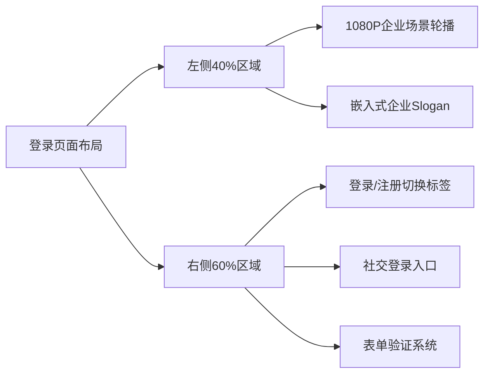
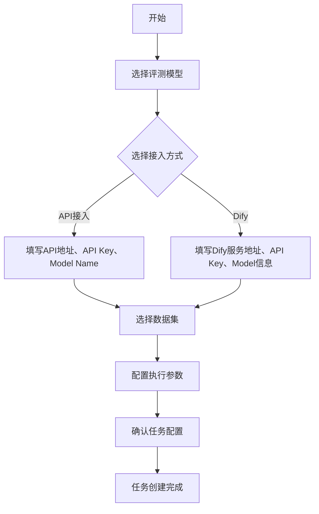

# 在线大模型评测系统需求文档（修订版）
## 一、用户体系
### 1.1 登录注册模块

```mermaid
graph LR
    登录界面[登录页面布局] --> 左分栏[左侧40%区域]
    左分栏 --> 轮播图[1080P企业场景轮播]
    左分栏 --> Slogan[嵌入式企业Slogan]
    
    登录界面 --> 右分栏[右侧60%区域]
    右分栏 --> SwitchTab[登录/注册切换标签]
    右分栏 --> SocialLogin[社交登录入口]
    右分栏 --> FormValidation[表单验证系统]
```

## 二、核心评测系统
### 2.1 评测任务管理
任务管理功能包括：
- 评测任务创建
- 评测任务列表
- 评测任务详情(实时日志查看)
- 评测任务删除
- 评测任务终止
- 评测任务结果查看

#### 2.1.1 评测任务创建

```mermaid
graph TB
    A[开始] --> B[选择评测模型]
    B --> C{选择接入方式}
    C -->|API接入| D1[填写API地址、API Key、Model Name]
    C -->|Dify| D2[填写Dify服务地址、API Key、Model信息]
    
    D1 --> E[选择数据集]
    D2 --> E
    E --> F[配置执行参数]
    F --> G[确认任务配置]
    G --> H[任务创建完成]

```

### 2.2 数据集管理